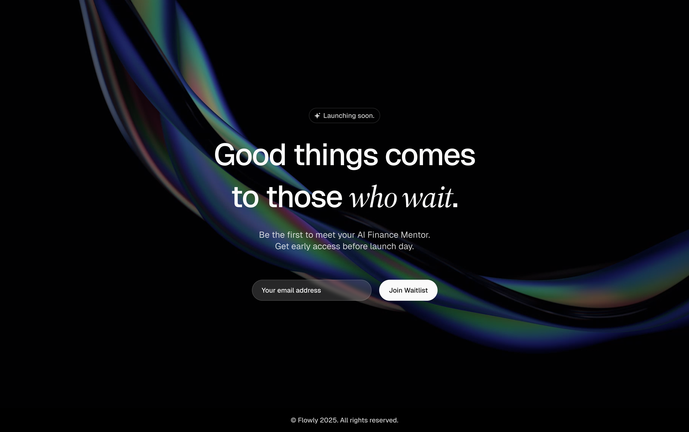

# Flowly Waitlist

<div align="center">
  
  
  **AI Finance Mentor waitlist page with glassmorphism design, SEO optimization, and Loops email integration.**
  
  [](https://getflowly.io)
  [](https://vitejs.dev/)
  [](https://reactjs.org/)
  [](https://www.typescriptlang.org/)
</div>

## About / Overview

Flowly is an AI-powered financial guidance platform that helps users understand, plan, and grow their money effortlessly. This waitlist page serves as the landing page for early access signups, featuring a modern glassmorphism design with video backgrounds and seamless email integration.

The project is built with modern web technologies and optimized for performance, accessibility, and SEO. It includes a secure serverless API for handling waitlist subscriptions through Loops email service.

## Tech Stack

- **Frontend Framework**: React 19.1.1 with TypeScript
- **Build Tool**: Vite with Rolldown
- **Styling**: Tailwind CSS 4.1.14 with custom glassmorphism components
- **UI Components**: Radix UI primitives with custom styling
- **Email Service**: Loops API integration
- **Deployment**: Vercel with serverless functions
- **Package Manager**: pnpm
- **Linting**: ESLint with TypeScript support

## Setup / Installation

### Prerequisites
- Node.js 18+ 
- pnpm (recommended) or npm
- Vercel account (for deployment)

### Local Development

1. **Clone the repository**
   ```bash
   git clone https://github.com/your-username/flowly-waitlist.git
   cd flowly-waitlist
   ```

2. **Install dependencies**
   ```bash
   pnpm install
   # or
   npm install
   ```

3. **Set up environment variables**
   
   Create a `.env.local` file in the root directory:
   ```env
   # App Configuration
   VITE_APP_URL=https://getflowly.io
   VITE_APP_NAME=Flowly
   VITE_APP_DESCRIPTION=Meet your AI Finance Mentor. Get early access to Flowly's revolutionary AI-powered financial guidance platform.
   ```

4. **Start development server**
   ```bash
   pnpm dev
   # or
   npm run dev
   ```
   
   The app will be available at `http://localhost:5173`

### Production Deployment

1. **Set up Vercel environment variables**
   
   In your Vercel dashboard, add:
   ```env
   LOOPS_API_KEY=your_loops_api_key_here
   ```

2. **Deploy to Vercel**
   ```bash
   vercel --prod
   ```

## Usage

### For Users
1. Visit the waitlist page
2. Enter your email address
3. Click "Join Waitlist" to subscribe
4. Receive confirmation and updates via email

### For Developers

**Available Scripts:**
```bash
pnpm dev          # Start development server
pnpm build        # Build for production
pnpm preview      # Preview production build
pnpm lint         # Run ESLint
pnpm lint:fix     # Fix ESLint issues
pnpm type-check   # Run TypeScript type checking
```

**API Endpoints:**
- `POST /api/join-waitlist` - Subscribe to waitlist

## Project Structure

```
waitlist/
├── api/                    # Serverless API functions
│   └── join-waitlist.ts   # Waitlist subscription handler
├── public/                 # Static assets
│   ├── favicon.png
│   ├── og-image.jpg
│   ├── robots.txt
│   └── sitemap.xml
├── src/
│   ├── assets/            # Video and media files
│   ├── components/        # React components
│   │   ├── ui/           # Reusable UI components
│   │   ├── Buttons.tsx
│   │   ├── Footer.tsx
│   │   ├── Inputs.tsx
│   │   └── Pill.tsx
│   ├── config/           # Configuration files
│   ├── lib/              # Utility libraries
│   ├── services/         # API service layer
│   ├── App.tsx           # Main application component
│   └── main.tsx          # Application entry point
├── thumbnail.jpg         # Project thumbnail
└── README.md
```

## Features

### ✨ Design & UX
- **Glassmorphism Design**: Modern glass-like UI with backdrop blur effects
- **Video Background**: Engaging financial concept video with overlay protection
- **Responsive Design**: Optimized for all device sizes
- **Accessibility**: WCAG compliant with proper ARIA labels and keyboard navigation
- **Toast Notifications**: User feedback for form submissions

### 🔧 Technical Features
- **TypeScript**: Full type safety throughout the application
- **Modern React**: Uses React 19 with hooks and functional components
- **Performance Optimized**: Fast loading with Vite and optimized assets
- **SEO Ready**: Complete meta tags, structured data, and sitemap
- **Error Handling**: Comprehensive error handling with user-friendly messages

### 📧 Email Integration
- **Loops Integration**: Secure serverless API for email management
- **Duplicate Prevention**: Handles duplicate email subscriptions gracefully
- **Source Tracking**: All contacts tagged with `source: "waitlist"`
- **Validation**: Client and server-side email validation

### 🚀 SEO Features
- **Meta Tags**: Open Graph and Twitter Cards support
- **JSON-LD**: Structured data for search engines
- **Sitemap**: XML sitemap for search engine indexing
- **Robots.txt**: Search engine crawling instructions
- **Canonical URLs**: Proper URL canonicalization

## Environment Variables

### Frontend (.env.local)
```env
# App Configuration
VITE_APP_URL=https://getflowly.io
VITE_APP_NAME=Flowly
VITE_APP_DESCRIPTION=Meet your AI Finance Mentor...
```

### Vercel Environment Variables
```env
LOOPS_API_KEY=your_loops_api_key_here
```

## Loops Integration

This waitlist integrates with [Loops](https://loops.so/) for email management:

- **Secure API Key**: Loops API key stored server-side only
- **Serverless Function**: `/api/join-waitlist` handles all Loops integration
- **Automatic Contact Creation**: New emails added to Loops contact list
- **Source Tracking**: All contacts tagged with `source: "waitlist"`
- **Error Handling**: Comprehensive error handling with user-friendly messages

### Setting up Loops

1. Create a Loops account at [loops.so](https://loops.so/)
2. Get your API key from the Loops dashboard
3. Add the API key to your Vercel environment variables as `LOOPS_API_KEY`
4. Deploy to Vercel - the integration will automatically handle contact creation

## Contributing

### Git Workflow
1. Always work from feature branches
2. Create feature branch from `develop`: `git checkout -b feature/your-feature-name`
3. Make changes and commit frequently with clear messages
4. Push branch and create Pull Request to `develop`
5. Never commit directly to `develop` or `main`

### Code Standards
- Follow TypeScript best practices
- Use ESLint for code quality
- Write small, focused components
- Add proper error handling
- Include accessibility attributes
- Test on multiple devices and browsers

## License

This project is proprietary software. All rights reserved.

---

**Live Demo**: [https://getflowly.io](https://getflowly.io)